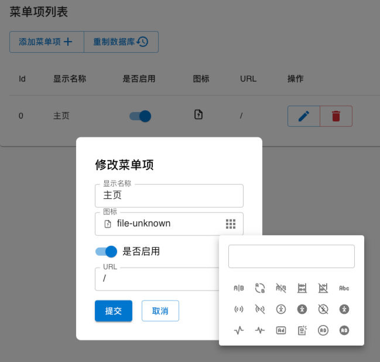
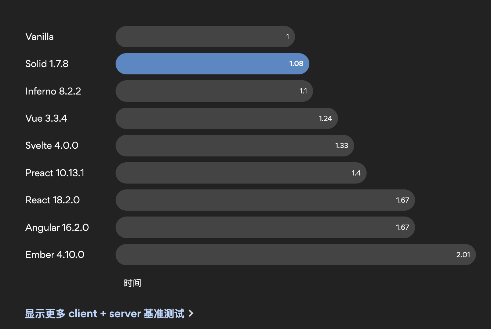

# 轻量化平台开发大作业

## 目录结构

- `/docs`：一些文档和笔记
    - `assets`：存放所有文档中的资源（比如截图）
- `/frontend`：前端项目的根目录
    - `dist`：**构建产物**


## 使用技术

- [Solid](https://www.solidjs.com/)：响应式框架

    - 新的 beta 版本文档：https://docs.solidjs.com/

- [Solid Router](https://github.com/solidjs/solid-router)：路由

- [SUID](https://suid.io/)：Material Design 组件库

    这个组件库是对 React 组件库 [MUI](https://mui.com/core/) 在 Solid 上的实现。

    （可能这个组件库风格与商城内容，以及可用组件没有那么“现成”的商城组件，所以有些内容可能需要手搓）

- [UnoCSS](https://unocss.dev/)

    原子化 CSS 框架，简单来说，就是把常用的 css 属性组合为一个个的类，只需要根据需要往 `class` 中填对应的类就好了。

    文档除了 UnoCSS 的文档，还可以查 [TailwindCSS](https://tailwindcss.com/docs/installation) 的文档。

    比如：

    ```css
    .container {
        width: 100%;
        background-color: white;
        display: flex;
        flex-direction: column;
    }
    ```

    就可以写成：

    ```html
    <div class="w-full bg-white flex flex-col"></div>
    ```

<s>引入后端</s>（懒逼了，直接 localstorage 搓个 db 模拟下后端接口响应好了）：

- <s>[Axios](https://github.com/axios/axios)：用于前端向后端发请求</s>
- <s>Golang + Gin</s>

## 第三次作业

- [x] 纯react静态页面 60

    - [x] 登陆注册

    - [x] 菜单管理

        数据定义为：

        ```ts
        type MenuItem = {
          id: number,
          name: string,
          icon: string,
          url: string,
          enable: boolean,
        }
        ```

        - [x] 创建、删除、修改
        - [x] **<font color="fuchisa">【extra】实现了一个图标选择器（在菜单项编辑弹窗中可以使用到）</font>**

            上面的输入框可以进行搜索，基于 trie 字典树，图标来源为 iconify 的 tabler，共 5289 个图标。

            

    - [x] 用户管理

        数据定义为：

        ```ts
        type Manager = {
          id: number,
          username: string,
          password: string,
        }
        ```

        通过 id 是否为 0 来区分 超级管理员 与 普通管理员。

        - 超级管理员：可以 添加/修改/删除 管理员账号

        - 普通管理员：只能 添加 管理员账号

    - [ ] 角色 / 权限

- [x] 后台用户管理 10

- [ ] 角色管理 10

- [x] 菜单管理 10

- [x] 数据持久化 10

- [ ] 后端联动 20

## 第四次作业

### 1. 作业内容

#### 前台

- [ ] 登陆注册
- [ ] 商城主页面
    - [ ] 首页
        - [ ] 搜索框、轮播图、热门商品
    - [ ] 分类
        - [ ] 所有商品的分类索引
    - [ ] 购物车
    - [ ] 我的
- [ ] 购买商品全程的界面
    - [ ] 商品详细信息页面
    - [ ] 创建订单页面
    - [ ] 支付页面
    - [ ] 订单详情页面

#### 后台

- [ ] 登录
- [ ] 权限、角色管理
- [ ] 商品管理
- [ ] 分类管理
- [ ] 订单管理
    - [ ] 发货（？？？

#### 其他

可以参考 https://github.com/macrozheng/mall

- 基本：借助 localStorage 实现前后台数据的联动
- 进阶：搓个后端实现前后台数据的联动

### 2. 评分项

划掉的不打算做，剩下的全做满可以做 120 分。

- [x] <s>**代码质量/风格** 10</s> 送分

- [x] <s>**界面美观度** 10</s> 送分

- [x] <s>**答辩情况** 10</s> 送分

- [ ] **基础功能** 60

- [ ] **单品/满减优惠券** 5

    这个比较简单，就是搓一个小组件，码量极少

- [ ] **我的足迹及收藏** 5

    这个也比较简单

- [ ] **页面适配** 10

    感觉可能全部做完最后再做好一些，

    因为移动端布局的确定可能受页面元素内容影响比较大

- [ ] **后端实现前后台联动** 5

    直接 Golang 光速搓一个后端，也可以有

- [ ] **后台统计图表** 5

    也很简单，调个 echarts 或者之类的 API

- [ ] <s>秒杀/抢购 5</s> 这个太抽象了

- [ ] <s>退货流程 5</s> 这个太不划算了，码多分少

---

## 有关 Solid

Solid 是一个比较新的前端框架，写起来和 React 比较相似：

- 基础 API `createSignal` 与 `useState`
- 都使用 jsx/tsx

区别在于：

- React 的响应性实现基于运行时对「虚拟 DOM」的比较与操作，某一个属性的变化会导致整个组件的重新执行。
- Solid 的响应性实现为 Fine-grained Reactivity（细粒度响应），无「虚拟 DOM」，因此也不需要运行时环境。

简单来说，就是，快：



不过因为比较新，所以，相关生态没有 React 那么强。

不过够用（）

---

## 作业内容及评分项

