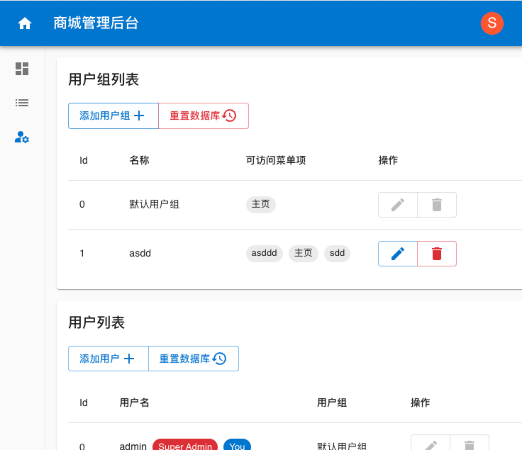
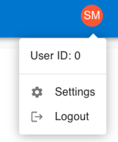
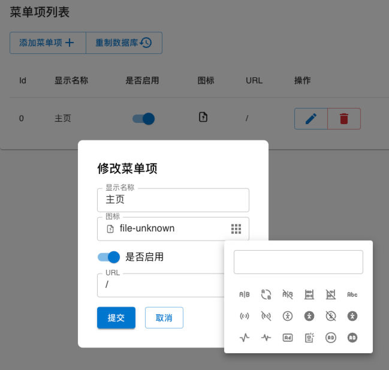

# 第三次作业

## 使用技术

- [Solid](https://www.solidjs.com/)：响应式框架

    - 新的 beta 版本文档：https://docs.solidjs.com/

- [Solid Router](https://github.com/solidjs/solid-router)：路由

- [SUID](https://suid.io/)：Material Design 组件库

    这个组件库是对 React 组件库 [MUI](https://mui.com/core/) 在 Solid 上的实现。

    （可能这个组件库风格与商城内容，以及可用组件没有那么“现成”的商城组件，所以有些内容可能需要手搓）

- [UnoCSS](https://unocss.dev/)

    原子化 CSS 框架，简单来说，就是把常用的 css 属性组合为一个个的类，只需要根据需要往 `class` 中填对应的类就好了。

    文档除了 UnoCSS 的文档，还可以查 [TailwindCSS](https://tailwindcss.com/docs/installation) 的文档。

    比如：

    ```css
    .container {
        width: 100%;
        background-color: white;
        display: flex;
        flex-direction: column;
    }
    ```

    就可以写成：

    ```html
    <div class="w-full bg-white flex flex-col"></div>
    ```

<s>引入后端</s>（懒逼了，直接 localstorage 搓个 db 模拟下后端接口响应好了）：

- <s>[Axios](https://github.com/axios/axios)：用于前端向后端发请求</s>
- <s>Golang + Gin</s>

## 「品尝」手册

### 1. 数据库初始数据及重置方法

数据库初始数据如下：

```ts
const defaultData: Data = {
  usergroups: [{ id: 0, name: "默认用户组", access: [0] }],
  managers: [{ id: 0, usergroup: 0, username: "admin", password: "admin" }],
  menuItems: [{ id: 0, name: "主页", icon: "file-unknown", url: "/", enable: true }]
};
```

即：

- 菜单项默认有一个「主页」，icon 为 `file-unknown`，url 为 `/`
- 用户组默认有一个「默认用户组」，可以访问「主页」菜单项。
- 用户默认有一个「超级管理员」，属于「默认用户组」，用户名和密码都是 `admin`

登入后每个页面都有一个「重置数据库」按钮可以恢复到如上初始数据。

### 2. 界面



登陆后，右上角头像超级管理员为橙色背景 SM（SuperManager），普通管理员为 M（Manager），点击可以弹出菜单进行登出（Settings 是虚假的）：



侧边栏有三个功能：主页、菜单项管理、用户及用户组管理。

### 3. 其他懒得写了

哦对，有关路由。

由于直接按照第四次作业搭的框子，所以管理页面路由都在 `/admin` 下。

不过没有关系，临时写了 `/` -> `/admin` 的重定向，并且给 404 page 添加了到 `/admin` 的按钮。

<font color="red">注意：直接 serve solid-router 构建结果时，手动输入路由会 404（可能视使用的 http server 而定），因为本质上还是个 SPA，但是不像 vue 的 router 使用的 `/#xxxx` 的方式作为 url 而是直接正常的 `/xx/xxx`，所以对于某些 http server，访问 `/xx/xxx` 时，由于只有一个 `index.html` 会导致 404）。一个无脑但是比较简单的应对方法就是手动输路由到 `/` 然后再导航过去，当然也可以让 http server 每次返回 index.html 的内容</font>

## 实现功能

- [x] 纯react静态页面 60

    - [x] 登陆注册

    - [x] 菜单管理

        数据定义为：

        ```ts
        type MenuItem = {
          id: number,
          name: string,
          icon: string, // iconify 图标 id
          url: string,
          enable: boolean,
        }
        ```

        - [x] 创建、删除、修改
        - [x] **<font color="fuchisa">【extra】实现了一个图标选择器（在菜单项编辑弹窗中可以用到）</font>**

            上面的输入框可以进行搜索，基于 trie 字典树，图标来源为 iconify 的 tabler，共 5289 个图标。

            

    - [x] 用户管理

        用户定义如下：

        ```ts
        type Manager = {
          id: number,
          username: string,
          password: string,
        }
        ```

        通过 id 是否为 0 来区分 超级管理员 与 普通管理员。

        - 超级管理员：可以 添加/修改/删除 管理员账号

        - 普通管理员：只能 添加 管理员账号

    - [x] 角色 / 权限

        以用户组的形式实现，一个用户可以属于一个用户组，一个用户组中的所有用户对菜单项具有相同的权限。

        用户组定义如下：

        ```ts
        type Usergroup = {
          id: number,
          name: string,
          access: number[] // 可以访问的菜单项 id
        }
        ```

- [x] 后台用户管理 10

- [x] 角色管理 10

- [x] 菜单管理 10

- [x] 数据持久化 10

- [ ] 后端联动 20