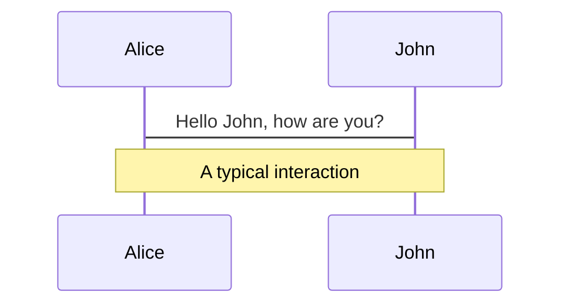
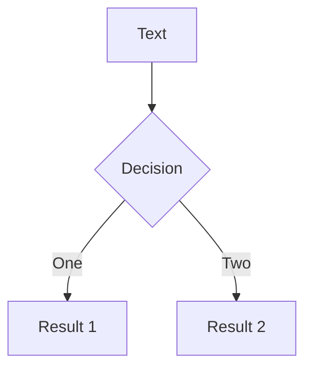
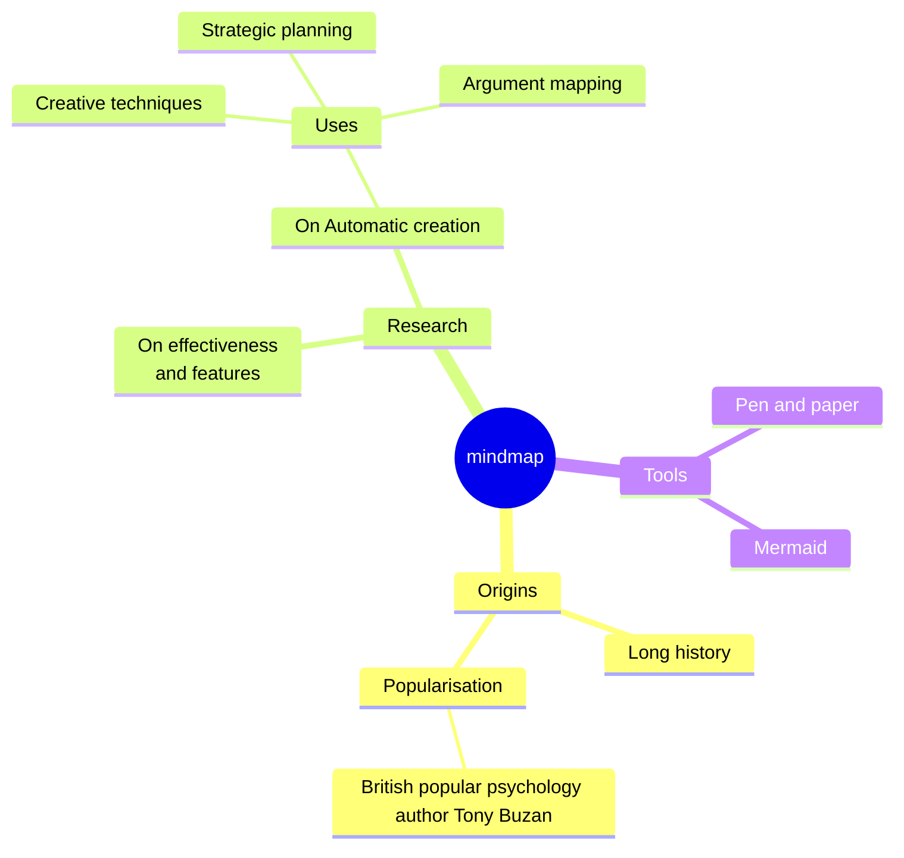
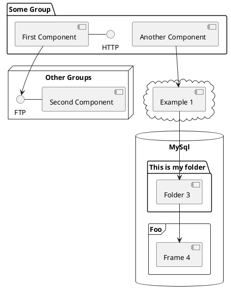

# 重量化商城系统

肖斌 俞贤皓 付家齐 杨鹏 谷雅丰

<div class="absolute right-0 top-0 bottom-0 w-90 m-10">
  
  
  
</div>

---

# 目录

<Toc minDepth="1" maxDepth="2"></Toc>


---

# 所用技术

- <logos-nodejs-icon /> NodeJS + <logos-pnpm /> pnpm
- <logos-react /> React + <logos-material-ui /> Mui
- <logos-tailwindcss-icon /> TailwindCSS
- <logos-java /> Java + <logos-spring-icon /> Spring + <logos-mysql-icon /> MySQL

---
hideInToc: true
---

# 所用技术 {.inline-block.view-transition-title}

- <logos-nodejs-icon /> NodeJS + <logos-pnpm /> pnpm
- <logos-react /> React + <logos-material-ui /> Mui
- <logos-tailwindcss-icon /> TailwindCSS
- <s><logos-java /> Java + <logos-spring-icon /> Spring + <logos-mysql-icon /> MySQL</s>
  <br/>答辩不用
- <logos-go /> Golang + <logos-gin /> Gin + GORM + <logos-postgresql /> PostgreSQL
  <br/>优雅

---
hideInToc: true
---

# 所用技术 {.inline-block.view-transition-title}

- <logos-nodejs-icon /> NodeJS + <logos-pnpm /> pnpm
- <logos-react /> React + <logos-material-ui /> Mui
- <logos-tailwindcss-icon /> TailwindCSS
- <logos-go /> Golang + <logos-gin /> Gin + GORM + <logos-postgresql /> PostgreSQL

---
hideInToc: true
---

# 不用技术 {.inline-block.view-transition-title}

- <s><logos-nodejs-icon /> NodeJS + <logos-pnpm /> pnpm</s>
- <s><logos-react /> React + <logos-material-ui /> Mui</s>
- <s><logos-tailwindcss-icon /> TailwindCSS </s>
- <s><logos-go /> Golang + <logos-gin /> Gin + GORM + <logos-postgresql /> PostgreSQL</s>

---
layout: two-cols
clicks: 9
hideInToc: true
---

# 不用技术 {.inline-block.view-transition-title}

- <s><logos-nodejs-icon /> NodeJS + <logos-pnpm /> pnpm</s>
- <s><logos-react /> React + <logos-material-ui /> Mui</s>
- <s><logos-tailwindcss-icon /> TailwindCSS </s>
- <s><logos-go /> Golang + <logos-gin /> Gin + GORM + <logos-postgresql /> PostgreSQL</s>
  <span v-click="7"><br/>为了加两分确实不值</span>

::right::

# 所用技术

- <logos-bun /> bun
- <logos-solidjs-icon /> SolidJS + <logos-material-ui /> SUID（Mui in SoliJS）
- <logos-unocss /> unocss
- 简易 key-value 存储后端：express + lowdb
- 前后端交互：axios

<div v-click="[1, 2]" class="absolute bottom-0 left-0 right-0 bottom-30 flex h-60 justify-center">
  
  
</div>

<div v-click="[3, 4]" class="absolute bottom-0 left-0 right-0 bottom-30 flex h-70 justify-center">
  
</div>

<div v-click="[5, 6]" class="absolute bottom-0 left-0 right-0 bottom-30 flex h-90 justify-center">
  
</div>

<div v-click="9" class="absolute bottom-0 left-0 right-0 flex h-70 justify-center">
  <div class="w-60 relative" v-if="$slidev.nav.clicks === 9">
    <div class="relative w-40 h-40">
      
      
      
    </div>
    <div
      class="text-5xl absolute top-14 left-40 text-[#2B90B6] -z-1"
      v-motion
      :initial="{ x: -80, opacity: 0}"
      :enter="{ x: 0, opacity: 1, transition: { delay: 2000, duration: 1000 } }">
      Slidev
    </div>
  </div>
</div>

<!-- vue script setup scripts can be directly used in markdown, and will only affects current page -->
<script setup lang="ts">
const final = {
  x: 0,
  y: 0,
  rotate: 0,
  scale: 1,
  transition: {
    type: 'spring',
    damping: 10,
    stiffness: 20,
    mass: 2
  }
}
</script>

<div v-click="8" class="absolute bottom-0 left-0 right-0 bottom-20 text-center text-[32px] nb">
生命的价值在于从无意义中「建构」意义
</div>

---
clicks: 4
---

# Solidjs 与 React

````md magic-move {lines: true}
```tsx
// React
const Hello = () => {
  const [count, setCount] = useState(0);

  return (
    <button onClick={() => setCount(count + 1)}>
      Clicked {count} times
    </button>
  );
}
```

```tsx
// Solid
const Hello: Component = () => {
  const [count, setCount] = createSignal(0);

  return (
    <button onClick={() => setCount(count => count + 1)}>
      Clicked {count()} times
    </button>
  );
}
```
````

<br/>
<v-click>条件渲染、列表渲染、Context、ref...</v-click>

<br/>
<v-click><span v-mark.red="4">但是！没有虚拟 DOM，使用 fine-grained reactivity。</span></v-click>

---
class: px-20
---

# Themes

Slidev comes with powerful theming support. Themes can provide styles, layouts, components, or even configurations for tools. Switching between themes by just **one edit** in your frontmatter:

<div grid="~ cols-2 gap-2" m="t-2">

```yaml
---
theme: default
---
```

```yaml
---
theme: seriph
---
```


</div>

Read more about [How to use a theme](https://sli.dev/themes/use.html) and
check out the [Awesome Themes Gallery](https://sli.dev/themes/gallery.html).

---

# Clicks Animations

You can add `v-click` to elements to add a click animation.

<div v-click>

This shows up when you click the slide:

```html
<div v-click>This shows up when you click the slide.</div>
```

</div>

<br>

<v-click>

The <span v-mark.red="3"><code>v-mark</code> directive</span>
also allows you to add
<span v-mark.circle.orange="4">inline marks</span>
, powered by [Rough Notation](https://roughnotation.com/):

```html
<span v-mark.underline.orange>inline markers</span>
```

</v-click>

<div mt-20 v-click>

[Learn More](https://sli.dev/guide/animations#click-animations)

</div>

---

# Motions

Motion animations are powered by [@vueuse/motion](https://motion.vueuse.org/), triggered by `v-motion` directive.

```html
<div
  v-motion
  :initial="{ x: -80 }"
  :enter="{ x: 0 }"
  :click-3="{ x: 80 }"
  :leave="{ x: 1000 }"
>
  Slidev
</div>
```


<div
  v-motion
  :initial="{ x:35, y: 30, opacity: 0}"
  :enter="{ y: 0, opacity: 1, transition: { delay: 3500 } }">

[Learn More](https://sli.dev/guide/animations.html#motion)

</div>

---

# LaTeX

LaTeX is supported out-of-box powered by [KaTeX](https://katex.org/).

<br>

Inline $\sqrt{3x-1}+(1+x)^2$

Block
$$ {1|3|all}
\begin{array}{c}

\nabla \times \vec{\mathbf{B}} -\, \frac1c\, \frac{\partial\vec{\mathbf{E}}}{\partial t} &
= \frac{4\pi}{c}\vec{\mathbf{j}}    \nabla \cdot \vec{\mathbf{E}} & = 4 \pi \rho \\

\nabla \times \vec{\mathbf{E}}\, +\, \frac1c\, \frac{\partial\vec{\mathbf{B}}}{\partial t} & = \vec{\mathbf{0}} \\

\nabla \cdot \vec{\mathbf{B}} & = 0

\end{array}
$$

<br>

[Learn more](https://sli.dev/guide/syntax#latex)

---

# Diagrams

You can create diagrams / graphs from textual descriptions, directly in your Markdown.

<div class="grid grid-cols-4 gap-5 pt-4 -mb-6">









</div>

[Learn More](https://sli.dev/guide/syntax.html#diagrams)

---
foo: bar
dragPos:
  square: 691,32,167,_,-16
---

# Draggable Elements

Double-click on the draggable elements to edit their positions.

<br>

###### Directive Usage

```md

```

<br>

###### Component Usage

```md
<v-drag text-3xl>
  <carbon:arrow-up />
  Use the `v-drag` component to have a draggable container!
</v-drag>
```

<v-drag pos="393,460,261,_">
  <div text-center text-3xl border border-main rounded>
    Double-click me!
  </div>
</v-drag>


###### Draggable Arrow

```md
<v-drag-arrow two-way />
```

<v-drag-arrow pos="67,452,253,46" two-way op70 />

---
src: ./pages/multiple-entries.md
hide: false
---

---

# Monaco Editor

Slidev provides built-in Monaco Editor support.

Add `{monaco}` to the code block to turn it into an editor:

```ts {monaco}
import { ref } from 'vue'
import { emptyArray } from './external'

const arr = ref(emptyArray(10))
```

Use `{monaco-run}` to create an editor that can execute the code directly in the slide:

```ts {monaco-run}
import { version } from 'vue'
import { emptyArray, sayHello } from './external'

sayHello()
console.log(`vue ${version}`)
console.log(emptyArray<number>(10).reduce(fib => [...fib, fib.at(-1)! + fib.at(-2)!], [1, 1]))
```

---
layout: center
class: text-center
---

# Learn More

[Documentations](https://sli.dev) · [GitHub](https://github.com/slidevjs/slidev) · [Showcases](https://sli.dev/showcases.html)
